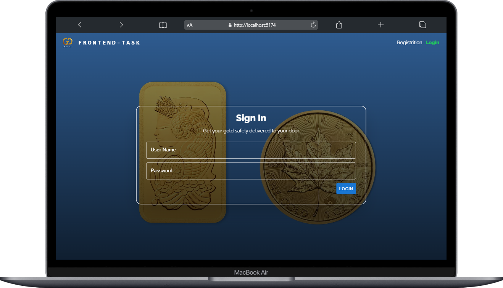
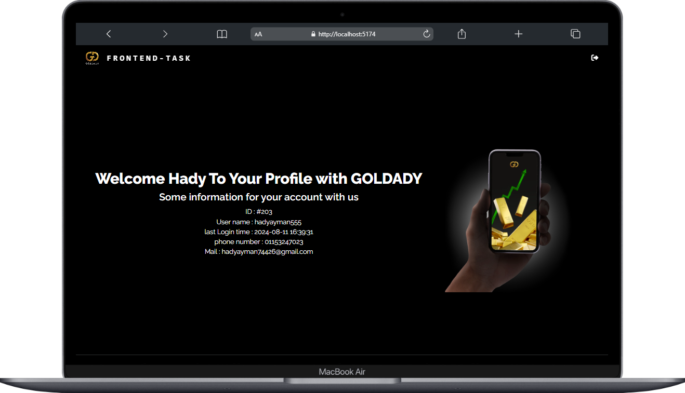
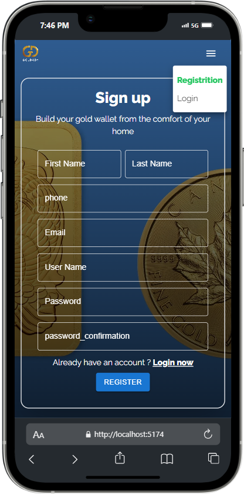

# React + Vite

#Frontend Authentication System with React
Project Overview : 
This project is a simple authentication system built with React. It includes user registration, login, protected routes, and responsive design for all pages.

*Technologies Used : 
Vite: For initializing the project quickly.
Tailwind CSS: For creating a responsive and clean design.
Material-UI: For utilizing pre-designed components.
Axios: For handling API requests and responses.
React Hot Toast: For displaying user feedback messages like "registration successful" or "password error".
Formik & Yup: For managing and validating form data.
Font Awesome: For adding icons to enhance the UI.

*Project Features : 
Registration Page: Includes fields for first name, last name, phone number, email, username, and password. It validates the inputs and shows success or error messages.
Login Page: Users can log in using their username and password. Successful login stores the token in cookies and redirects the user to a protected route.
Protected Routes: Ensures that only authenticated users can access certain parts of the application. If a user is not logged in, they will be redirected to the login page.
Profile Page: Displays the user’s information after successful login.
Not Found Page: If a user tries to access a page that doesn’t exist, they will see a message indicating that the page is not found.

*Additional Features : 
Logout Functionality: Allows users to log out of the system.
Responsive Design: Supports all types of screens using Tailwind CSS.
